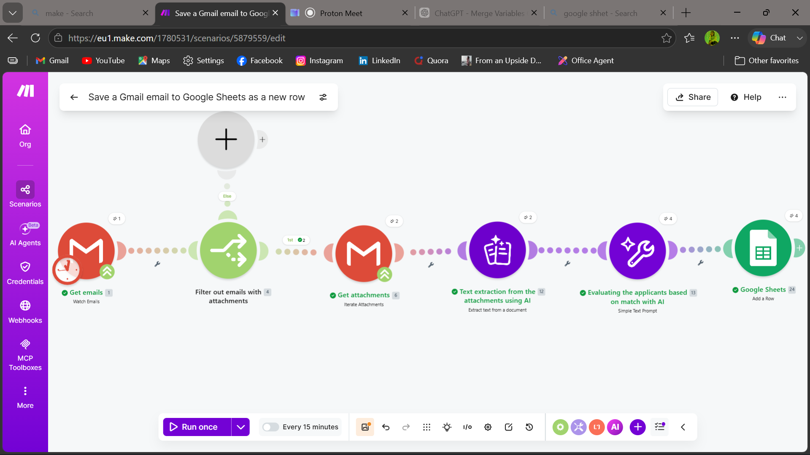

# 🤖 Automated Job Applicant Screening Using AI

---

## 📌 Overview

This project is an end-to-end automated recruitment pipeline built using **Make (formerly Integromat)**. It monitors a designated email inbox for job applications, extracts résumé attachments, evaluates each candidate's qualifications using an AI model, and automatically records the match percentage into a **Google Spreadsheet** — all without any manual intervention.

This eliminates the time-consuming task of manually reviewing each application, allowing recruiters to instantly see a ranked list of candidates based on their suitability for a specific role.

---

## 🎯 Objective / Usage

**Objective:**
To automate the initial screening phase of the hiring process by combining email monitoring, attachment extraction, AI-based evaluation, and spreadsheet logging into a single seamless workflow.

**Usage:**
This automation is designed to be used by recruiters or hiring managers who receive job applications via email. Once the scenario is active in Make, it runs automatically in the background. Every new applicant email is processed, evaluated, and logged without any human input required.

> **Target Job Role for This Demo:** Front-end Engineer (React, CSS)

---

## 🛠️ Tools & Technologies Used

| Tool | Purpose |
|---|---|
| **Make (formerly Integromat)** | Core automation platform — orchestrates the entire workflow |
| **Email Module (Make)** | Monitors the inbox and triggers the scenario on new emails |
| **AI / Text Analysis Module** | Analyzes résumé content and returns a match percentage |
| **Google Sheets Module (Make)** | Logs candidate names and their match percentage automatically |

---

## ⚙️ Description / How It Works

1. **Email Trigger**: The scenario starts with an email trigger that monitors a specific inbox for incoming job applications. When a new email arrives, it activates the workflow.

---

## 📸 Screenshots

### Section 1: Make Scenario Overview

> 📷 *Add a screenshot of your full Make scenario/flow here.*

```

```

*This screenshot shows the complete automation flow built inside Make, from the email trigger all the way to the Google Sheets module.*

---

### Section 2: Google Spreadsheet Output

> 📷 *Add a screenshot of your Google Spreadsheet with candidate names and percentages here.*

```

```

*This screenshot shows the final output — the spreadsheet populated automatically with each candidate's name and their AI-evaluated match percentage.*

---

## 💭 My Reflection

---

## ✅ Conclusion

---

> **Author:** *(Faria Akter)*
> **Date:** *(June, 2026)*
> **Category:** Automation | AI | Recruitment